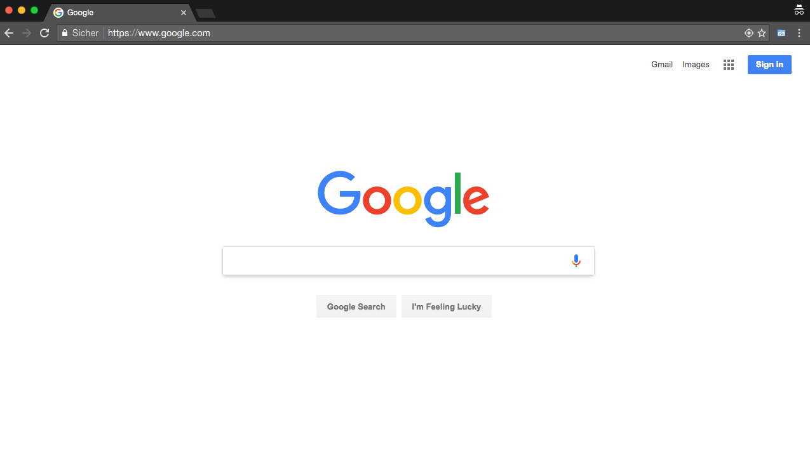
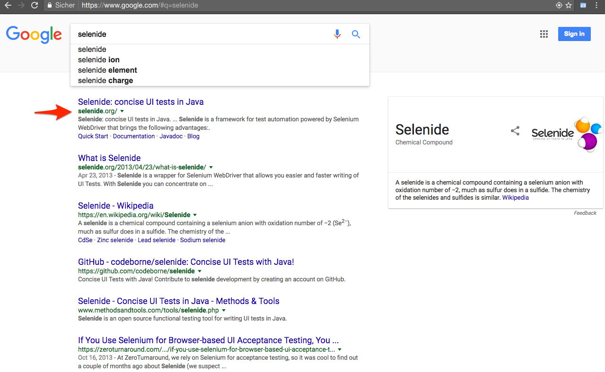
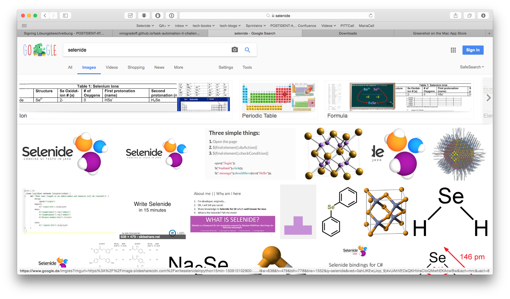
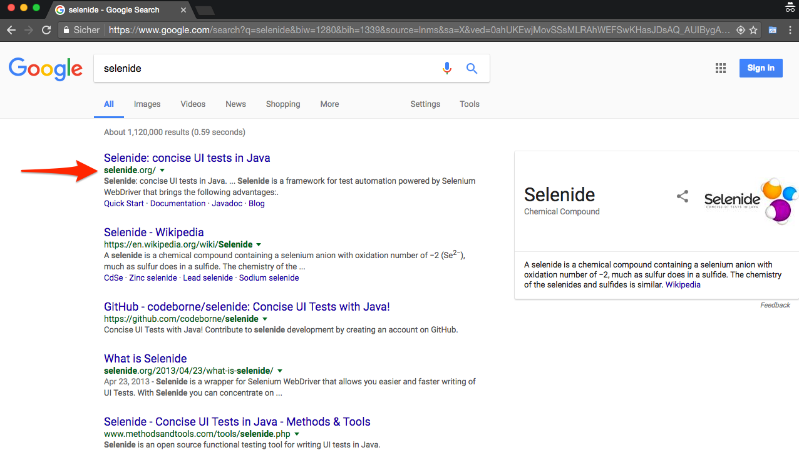

### Task
Please automate the following scenario as **one** UI Selenium-based test.

### Story
You've just got a job as QA Engineer at Google. Your first work field is to automate end-to-end tests for Google Search service, as the existing tests were altogether gone after the Big Bang Datacenter Crash. Team Lead suggests that ca. 50 user scenarios should be automated by you in the following 2-3 weeks, which means you have about 2 hours for scenario on average. You start with the scenario below.

### Rules

- Use your favorite programming language (e.g. Java, JavaScript, Python, Ruby, C# or whatever you know best).
- You may use any helping framework if you want to.
- Design it as **one** test, not three, not five. You may have more than one assert in your test.
- Selenium (2.x or 3.x - up to you) must be under the hood, but you may use any wrapper frameworks.
- Create README about how to start your test. Mention the prerequisites.
- You may use any help from the Internet, but please not let other people write code for you :)

### Timing
As you have _49 more tests_ to write (in our fictionaly story), you don't need to make a perfect test. Do just a **good enough test** for this situation (**2 hours** for one test _on average_). Take as much time or as few time as you need. If you have done your "good enough" test in just **30 minutes** - don't make it perfect, you may need the time later for the other tests, that could be more complex. If on the other hand, you think you need more time, e.g. **3-3,5 hours** - it is fine too, perhaps it will help you to save time in future tests reusing some code or ideas. Let your judgement guide you when to stop. 

### Scenario to automate

User wants to web-search for a "selenide" term getting the popular site as the top hit. Then search for the logo of the site, again hitting the relevant image. After that user returns to the "web search", and the result is still there. 

1. Goto http://google.com/ncr
2. Search for "selenide"
3. We expect to have a link to selenide.org as top-1 result.
4. Switch to Images search
5. We expect any results (just check, if something new was loaded)
6. Switch back to "All" link
7. We expect that we still have the same link to selenide.org as in step 3

### Screens illustrating the screnario

